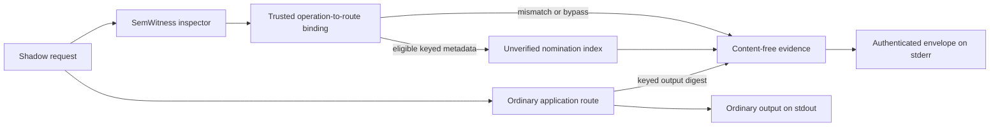

# Architecture

## Boundary

IntentABI is a runtime and evidence plane, not a second intent framework.
SemWitness owns Intent IR parsing/canonicalization, source and scope HMACs,
compiler/registry contracts, normalization witnesses, and promotion decisions.

`@intentabi/adapter-semwitness` uses only public SemWitness exports. The core
receives keyed correlation bindings, a read-only eligibility state, and
allowlisted reason codes. It cannot construct, inspect, or mutate Intent IR.

The core also owns no SemWitness, Agentic SDLC, storage, or CLI configuration.
Those composition schemas live in `apps/cli`; other hosts can replace every
port without changing the core ABI.

`@intentabi/codex-host` is a separate application boundary, not another
normalizer or evaluator. It consumes SemWitness's public `TextRequestPreparer`
contract and a provider-neutral exact-turn transport. It never imports or
reimplements the SemWitness normalizer corpus, statistical bounds, host
promotion evaluator, or intent-cache promotion evaluator.

## Runtime Flow

The ordinary route and shadow inspection start concurrently. The public result
waits for bounded shadow deadlines because it returns evidence alongside output;
this is bounded blocking, not a detached background job. Shadow failures change
evidence only, never the ordinary output.

## Semantic-to-Execution Lineage

`source` and `routeInput` are different representations and cannot be trusted to
match merely because they arrived in one request. The SemWitness adapter captures
the normalized registry operation ID and checks it against a trusted exact
`operationId -> routeInput` binding. It then derives keyed bindings over:

- SemWitness policy, normalizer artifact/config, and ontology;
- host-derived scope and scope epoch;
- route ID and immutable revision digest;
- the exact canonical route input.

A missing or different route binding yields `ROUTE_INPUT_MISMATCH`. The route
still executes, but no candidate probe occurs and the run is excluded from
convergence measurements.

## Fail-closed Reuse, Fail-open Availability

There is no active reuse path. `ShadowCandidateStore` exposes only
`probe(intentKey, signal)` and `observe(metadata, signal)`. A positive probe is
reported as `unverified-candidate-observed`; it is not proof that an authentic
or safe cache record exists. Candidate content is absent from the type system.

The runtime strictly parses inspector and store results at runtime. Malformed
values, unknown fields, non-read effects, route mismatches, scope mismatches,
and unknown reason codes cannot reach observation telemetry as eligible data.

## Evidence Envelope

Before delivery, the runtime creates a unique event ID and computes an HMAC over
`{schema, eventId, keyId, evidence}`. The sink receives the envelope and MAC
together. Policy/scope/route/input bindings are already inside the signed
evidence, so fields cannot be spliced between events without detection.

Replay detection remains a sink responsibility: `eventId` is the idempotency
key. If the HMAC provider fails, no bare evidence is emitted. A sink deadline is
reported as `unacknowledged`, because third-party adapters can ignore
cooperative cancellation even though the bundled sink and memory store honor it.

## Adapters

### SemWitness

The adapter copies its key material, uses constant-time comparison for expected
scope bindings, invokes `normalizeIntentShadow`, verifies the trusted route
binding, and exports only domain-separated HMAC keys. Its `intentKey` is a
shadow correlation key, **not** SemWitness's future cache-admission key.

The same adapter exposes the narrow
`exportIntentCachePromotionEvidenceJsonl` conformance exporter. It accepts only
a complete host-attested fixture for the public `semwitness/intent/host`
contract, validates it with SemWitness, serializes the parser-normalized records
as deterministic JSONL, and reparses the emitted bytes before returning them.
It does not convert an IntentABI shadow envelope: that envelope deliberately
lacks normalization/cache witnesses, held-out oracles, paired usage accounting,
and cohort bindings. Those facts must come from the host that observed them,
and only the SemWitness evaluator can return a qualification result. A valid
but underfilled corpus therefore remains a well-formed `qualified: false`
result rather than invented evidence.

`evaluateHostAttestedPromotionRun` composes SemWitness's authoritative assembler
and evaluator around the same deterministic serializer as the public exporter.
Its boundary is deliberately small: the host supplies only deployment
attestation plus already-sealed unknown case records. SemWitness validates and
freezes them, supplies protocol literals, derives aggregate counters and
corpus/binding digests, then parses the exact emitted JSONL bytes and decides
qualification. IntentABI retains no duplicate fixture in the result and has no
policy, repair, network, provider, store, cache, or candidate-content path.

The adapter can also receive an external `IntentProposalCompiler`. This port is
candidate generation only: the snapshotted declarative registry still resolves
the operation into trusted Intent IR, owns the effect, and enforces the exact
operation-to-route binding. The compiler is invoked once per observation.
Failures, malformed or unknown proposals, registry/compiler ontology
disagreement, and non-read effects bypass measurement. Compiler manifest plus
registry configuration are included in the adapter lineage digest.

The separate `apps/normalizer-pilot` composition uses that compiler boundary
for external conformance. It deterministically prepares a frozen CLINC150
registry and held-out fixture, delegates evaluation to SemWitness, and writes a
content-free private report. It does not run the application route, measure
cache value, produce promotion evidence, or authorize activation.
Its run binding covers source/registry/corpus digests, compiler manifest,
host-declared deployment and credential identities, pinned SemWitness evaluator,
attempts, and request count. The current evaluation is one-shot; durable
per-attempt progress and resume remain a release gate.

### Agentic SDLC

- `FixtureAgenticSdlcRoute` is deterministic and used for conformance.
- `AgenticSdlcCliRoute` invokes only `route decide` through
  `execFile(process.execPath, ...)` with `shell: false`.
- the exported strict schema supports current object-shaped entities, artifacts,
  and missing-context fields;
- raw user text is never passed to the child;
- child failures become constant, content-free error codes;
- entrypoint/root paths are canonicalized, options/environment are snapshotted,
  output/time are bounded, and route identity combines entrypoint hash plus a
  host-owned deployment revision digest.

The entrypoint is trusted and retains the current user's filesystem/network
authority. `allowedRoot` is a routing boundary, not an OS sandbox.

### Memory Store

The bundled store is single-process, single-scope, and development-only. It
validates and reconstructs exact metadata before mutation, honors cancellation,
and cannot retain response bodies. A production candidate index still needs
authenticated records, partitioning, durability, revocation, freshness, and an
independent SemWitness admission step.

### Codex Shadow Host

The host captures a string input, starts bounded SemWitness preparation, and
invokes `CodexTurnTransport.runExact` exactly once with the captured original.
The prepared content and safe SemWitness metadata are reduced immediately to
domain-separated HMACs and are never returned to the caller, evidence sink, or
transport. Proof content is not re-parsed: evidence records only
`present-unverified`, leaving semantic proof authority in SemWitness. Non-text
SDK inputs bypass preparation and pass through by object identity.

The SDK adapter validates and freezes one complete `ThreadOptions` snapshot,
passes that same object to `startThread`, and derives the transport binding from
it. Omitted SDK fields remain `unavailable:not-explicit`; external `CodexOptions`
and runtime defaults remain `unavailable:external-client`. Prompt/tool/AGENTS
digests are separately labeled `host-declared-unverified`. Turn options and
outputs are opaque and explicitly unbound: the host never reflects on either.

`@intentabi/adapter-codex-sdk` compile-checks the official stable
`Thread.run(input, options?)` contract against exact dev dependency `0.144.4`.
Native Codex CLI optionals are excluded from this source-only workspace; a
runnable composition package must opt into its platform binary. A version
change requires contract tests before the compatibility claim moves.

SemWitness preparation currently returns identity for unpromoted user prose.
That is expected. Intent normalization is evidence for equivalence research,
not authorization to rewrite a Codex prompt or serve a semantic-cache value.

### Codex Research Benchmark

`@intentabi/benchmark-core` is a provider-neutral paired-run contract. It owns
per-stratum/cache-block counterbalanced AB/BA planning, HMAC-authenticated
content-free receipts, strict accounting projection, and research-only
classification; it has no SDK or transport dependency. `@intentabi/codex-bench`
is a separate opt-in composition that binds that contract to the exact Codex
SDK/CLI `0.144.4` surface.

Each arm gets a fresh client/thread and a one-request loopback gateway. The
Codex child holds only a per-arm proxy credential; the parent gateway verifies
the exact input, instructions, text-only model, and `update_plan`-only surface,
projects a deterministic request, and alone holds the real upstream key. The
custom provider disables WebSockets and transport retries, while the persisted
provider URL fails closed until replaced by the live gateway URL. A public
fake-upstream canary exercises the staged binary before private cases run.

This is measurement infrastructure, not an activation path. Plans and receipts
carry HMAC references and key lineage but no prompts or responses. A keyed MAC
covers the complete canonical receipt body, while the protocol digest binds
versioned core/composition/gateway semantics and exact runtime policy. Results
remain diagnostic and cannot create a SemWitness promotion manifest.

## Extension Points

The core ports replace the route, inspector, nomination index, HMAC provider,
and evidence sink. Provider/model selection stays outside core. Any probabilistic
compiler remains non-authoritative behind SemWitness; any future active cache
must consume SemWitness's complete scope/dependency-aware admission contract.

## Qualification Lab

The [Qualification Lab](qualification-lab.md) is a separate application and
package boundary. It reuses neither `ShadowRuntime` nor the Codex benchmark's
content-bearing dataset types. Its core sees only HMAC-bound plan metadata plus
opaque private payload and already-sealed record references through generic
ports; it never reflects on or serializes those values. A SemWitness edge
adapter owns the only dependency on `semwitness/intent/host`, reparses the exact
JSONL bytes, independently re-evaluates them, and forwards complete host-sealed
records to the existing authoritative assembler/evaluator.

This separation lets Agentic SDLC, Codex, a local model, or another application
provide capture and oracle adapters without putting their schemas into the core
or creating a second semantic authority. The shipped Agentic SDLC adapter is a
read-only AB/BA route-contract-outcome oracle; it deliberately does not convert
its result into SemWitness evidence. `apps/qualification` consumes records that
the host has already sealed, publishes the exact private authority artifact via
atomic `0600` I/O, and emits only an authenticated content-free receipt.
