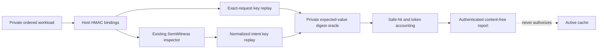

# Cache Impact Lab

## Product Contract

The Cache Impact Lab answers one bounded question before anyone builds an
active semantic cache:

> On this ordered workload, do SemWitness-normalized intent keys create more
> oracle-safe hits than exact-request keys, and is the measured token delta
> still positive after normalization overhead?

IntentABI owns the application-level replay and accounting. SemWitness remains
the only owner of Intent IR, registry compilation, normalization witnesses, and
normalization decisions. The integration uses the existing
`SemWitnessIntentInspector`; it does not copy or reinterpret SemWitness IR.

The lab never stores or returns a response, never skips an ordinary route, and
never emits a cache-admission credential. Every report fixes:

- `mode: "shadow"`;
- `classification: "diagnostic-cache-impact"`;
- `activationAuthorized: false`;
- `promotionManifest: "not-produced"`;
- `statisticalReadiness.ready: false`.

## Architecture



`@intentabi/benchmark-core` owns the provider-neutral study function. The CLI
composition owns bounded files, config parsing, HMAC key derivation, and the
SemWitness adapter. This keeps provider SDKs, vector stores, and deployment
choices outside the metric core.

## Workload Contract

Each ordered case contains:

- source text and locale, visible only inside the trusted process;
- exact route input plus config-owned route, scope, and scope epoch;
- `expectedValueDigest`, supplied by the host as the reuse oracle;
- observed ordinary model input/output tokens;
- observed normalization input/output tokens, including zero for deterministic
  local normalizers.

The host derives an HMAC raw key over source, locale, route, route input, scope,
and epoch. The SemWitness adapter derives a normalized key that already binds
policy, normalizer, ontology, route, route input, and scope. A bypass or
inspection failure falls back to the exact key; it cannot invent a semantic
hit.

The value digest is deliberately private and is not copied into the report.
It is an oracle observation, not proof that an answer is current or authorized.
A production experiment still needs freshness, authorization, dependency,
revocation, and task-quality oracles.

## Metric Semantics

For each key strategy, the ordered replay yields:

- `miss`: no previous value exists for the key;
- `safe-hit`: a previous value exists and its host oracle digest matches;
- `unsafe-hit`: the key collides but the host oracle digest differs.

Only safe hits avoid model tokens. Unsafe hits stay visible and are treated as
model executions for token accounting. The report separates candidate hits
from safe hits so a higher hit rate cannot hide false merges.

```text
safe hit rate ppm = round(safe hits / requests * 1,000,000)
safe hit lift     = normalized safe hits - raw safe hits

net input delta   = raw model input
                    - normalized model input
                    - normalization input

net output delta  = raw model output
                    - normalized model output
                    - normalization output

net total delta   = net input delta + net output delta
```

Positive delta means fewer observed tokens under the normalized shadow
strategy. It does not infer currency, latency, provider cache discounts, or
future traffic distribution.

The diagnostic gate fails on any raw or normalized unsafe hit, inspection
failure/timeout, lack of safe-hit lift, or non-positive net token delta. The
gate is intentionally stricter than printing an attractive cache-hit number,
but weaker than SemWitness promotion qualification.

## CLI

In a fresh source checkout, run `pnpm install --frozen-lockfile` and
`pnpm build` before invoking a workspace CLI.

```bash
INTENTABI_HMAC_SECRET="<at-least-32-bytes>" \
  pnpm cache:impact \
  --config config/cache-impact.example.json \
  --workload fixtures/cache-impact-workload.json
```

The CLI reads regular non-symlink files through the shared bounded I/O adapter,
parses closed schemas, bounds each inspector call, and emits one JSON event.
Config chooses registry, policy, scope, route bindings, route revision, timeout,
and HMAC key ID; nothing imports a provider or executable from configuration.

Exit codes:

| Code | Meaning                                                        |
| ---: | -------------------------------------------------------------- |
|  `0` | Complete workload passed the diagnostic safety/value gate.     |
|  `2` | Complete workload produced valid evidence but failed the gate. |
|  `1` | Input, key material, boundary, or execution failed.            |

## Build Versus Buy

This lab intentionally does not implement a semantic-cache engine:

- [RedisVL SemanticCache](https://redis.io/docs/latest/develop/ai/redisvl/api/cache/)
  already supplies vectorizers, distance thresholds, TTL, metadata, and filters.
- [GPTCache](https://github.com/zilliztech/GPTCache) already supplies modular
  embedding, vector storage, and similarity-evaluation components.
- [Semantic Router](https://github.com/aurelio-labs/semantic-router) already
  abstracts encoders and thresholded semantic routing.
- [vLLM](https://github.com/vllm-project/vllm) already exposes engine-level
  prefix-cache query/hit token metrics below this application boundary.

The differentiated layer is evidence before activation: typed intent keys,
route/scope binding, a value oracle, safe-versus-unsafe hit separation, and
normalization-aware token accounting. A future active implementation should
adapt a mature store after qualification instead of adding a vector database
here.

## Acceptance Threshold

- deterministic replay of the same parsed workload yields the same report body
  and HMAC under the same key;
- configured paraphrases create more safe normalized hits than raw hits in the
  bundled fixture;
- distinct value digests on one normalized key fail the safety gate;
- bypass, fault, and timeout paths cannot become semantic hits;
- no source text or expected value digest appears in the report;
- token arithmetic uses exact integer counters and keeps negative deltas;
- all existing workspace checks and cross-platform CI remain green.
