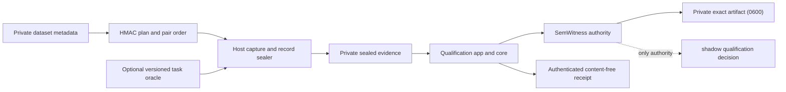

# Qualification Lab

## Product Claim

The Qualification Lab is a provider-neutral planner and evidence handoff for
counterbalanced shadow experiments. A host captures ordinary/candidate arms and
seals exactly one authority-owned record per private case. The Lab binds those
records to a predeclared plan, submits them to the configured authority, and
publishes an authenticated content-free receipt. The core never interprets an
intent, decides semantic equivalence, stores a reusable value, or activates a
cache.

SemWitness remains the only component that can assemble and evaluate an intent
cache promotion artifact. The CLI returns exit code `0` only when that authority
qualifies the exact evidence, but its receipt still says
`activationAuthorized: false`. Exit code `2` is a complete, valid, unqualified
run; exit code `1` is an execution or boundary failure.

## Boundary



The core owns deterministic planning, ordered record handoff, authority binding,
cancellation, and receipt authentication only. Its replaceable ports are:

- `QualificationCaseRunner`: returns one already-sealed authority record for a
  private payload and its immutable plan cell;
- `QualificationAuthority`: validates all sealed records and returns the
  decision plus ordered content-free bindings;
- `authenticateReceipt`: MACs the complete canonical receipt body.

File parsing and publication live in the application through `@intentabi/cli-io`.
No core type contains a provider SDK, SemWitness type, Agentic SDLC schema,
prompt, response, intent IR, tenant label, filesystem path, or cache value. The
core retains opaque payload/record references only for the duration of a run and
never reflects on or serializes them.

The Agentic SDLC adapter is a separate Level 0 oracle: it performs read-only
`task start` replay in AB and BA order across four byte-identical roots and
projects route, contract, outcome, and project state through HMACs. It does not
invent or translate SemWitness promotion records; a host-owned capture adapter
must still provide complete usage, oracle, scope, and dependency evidence.

## Experiment Contract

Every case declares a bounded ordinal, cohort, difficulty, cache regime, and
pair order. Population cases use one independence-cluster reference. Adversarial
cases use a predeclared scenario and phenomena vocabulary. References are
opaque keyed bindings supplied by the trusted host, never raw business labels.

The combined core, application, and host contract enforce these invariants at
their respective trust boundaries:

1. ordinals are contiguous and unique;
2. case and file/record byte budgets are fixed before the app reads evidence;
   provider call, token, and wall-clock budgets remain host-owned and must be
   bound into the external attestation;
3. ordinary/candidate order is balanced inside each declared stratum;
4. each primary-order arm is invoked at most once with a fresh execution scope;
   an optional mirrored reverse order is a repeatability control and never a
   second statistical opportunity;
5. a host oracle runs only after both arms return complete observations;
6. expected arm/oracle/accounting failures must arrive as authority-owned failed
   records; an exception, timeout, cancellation, malformed port, or missing
   record aborts publication and can never become a positive result;
7. every attempted case is accounted for; cases are not silently dropped;
8. raw inputs never enter receipts, stdout, errors, or paths; the exact sealed
   evidence and authority workbench are persisted only in the explicitly
   requested owner-only private artifact;
9. the exact evidence bytes are reparsed and independently re-evaluated; a
   detached workbench result is rejected rather than repaired or trusted;
10. no code path can submit candidate content to a production request or read a
    cached response.

## Evidence Levels

### Level 0: conformance

A deterministic fixture proves ordering, isolation, failure accounting,
privacy, exact replay, and adapter boundaries. Its result is always diagnostic
and cannot satisfy a held-out or production claim.

### Level 1: external qualification evidence

A host-owned run additionally binds an immutable dataset/source revision,
family-safe split, inclusion policy, sampling window, provider/runtime/model,
prompt and tool contract, tokenizer, cost model, oracle, evaluator, and every
dependency that can change an answer.

SemWitness decides whether that evidence passes. IntentABI must not duplicate
its counters, confidence bounds, or gate reasons. In particular, a small curated
fixture cannot claim statistical readiness. With zero observed failures, a
one-sided 95% upper bound of `0.001` requires approximately 2,995 independent
trials; stricter response-cache claims require more.

### Level 2: active reuse

Out of scope. It still requires an authenticated, scope-bound store; complete
freshness, authorization, dependency, invalidation, and revocation checks; a
post-read SemWitness admission decision; an authenticated activation artifact;
and a separately versioned active-mode contract.

## First Delivery Slice

The first slice ships the provider-neutral planner/runner, strict schemas, the
separate `intentabi-qualify` application, a read-only Agentic SDLC oracle,
SemWitness handoff, content-free receipts, reusable atomic private I/O, and
cross-platform tests. `validate` reads no secret and performs no authority call;
`plan` emits only HMAC-bound case references and pair order; `run` requires the
explicit `--execute` flag, consumes already-sealed evidence, reserves its output
before authority work, and atomically publishes complete `0600` bytes.

The app does not call an LLM or synthesize evidence. Level 1 capture remains a
separate opt-in, potentially billable host workflow. This slice proves the
Level 0 boundaries and makes that evidence consumable without weakening the
authority boundary.

```bash
# Schema/budget check only: no secret, execution, or authority call.
pnpm qualify validate \
  --config config/qualification.example.json \
  --dataset /private/held-out-metadata.json

# Content-free plan for the capture host.
INTENTABI_QUALIFICATION_HMAC_SECRET="$(openssl rand -hex 32)" \
  pnpm qualify plan \
  --config config/qualification.example.json \
  --dataset /private/held-out-metadata.json

# Evaluate already-sealed records and publish a private exact artifact.
INTENTABI_QUALIFICATION_HMAC_SECRET="<same-secret>" \
  pnpm qualify run \
  --config config/qualification.example.json \
  --dataset /private/held-out-metadata.json \
  --evidence /private/semwitness-input.json \
  --out /private/qualification-artifact.json \
  --execute
```

The example configuration contains placeholder protocol and key identifiers.
Replacing them and supplying a real immutable private dataset/evidence artifact
is part of the host's Level 1 protocol; the repository does not ship a fixture
that can be mistaken for qualification evidence.

It deliberately does not ship embeddings, a vector database, a semantic-cache
engine, a general natural-language compiler, a response cache, or automatic
activation. RedisVL, GPTCache, vCache, Semantic Router, and provider prefix/KV
caches are future replaceable candidates or baselines, not code to reimplement.

## Acceptance Criteria

### Must for this slice

- the package core has no provider, SemWitness, Codex, or Agentic SDLC import;
- a deterministic run counterbalances AB/BA per stratum and accounts for every
  attempted case;
- expected execution/accounting/oracle failures are supplied as sealed failure
  records; malformed ports, thrown failures, and cancellation abort safely;
- a repeated run with the same protocol and deterministic ports produces the
  same content-free result digest;
- public receipts/stdout/errors contain no case payload, prompt, response, raw
  label, tenant, path, provider error, or environment value; the private
  artifact intentionally retains the exact SemWitness evidence/workbench;
- output uses bounded reads, an owner-only temporary sibling, flush/fsync,
  atomic no-clobber publication, and cleanup on failure;
- the SemWitness adapter forwards already sealed records to the existing
  assembler/evaluator, reparses the exact JSONL, and returns the independently
  recomputed authoritative result;
- tests cover qualified/unqualified flows, arm/order divergence, timeout,
  cancellation, hostile getters/proxies, duplicate/gapped ordinals, imbalance,
  oversize input, mutation races, symlink/no-clobber output, privacy canaries,
  and deterministic replay;
- `pnpm check`, dependency audit, and CI pass on Linux, macOS, and Windows.

### Must before a qualification claim

- an external held-out source and sampling protocol are immutable and auditable;
- all SemWitness minimum population, critical-cell, adversarial-cell,
  independence, coverage, false-hit, task-quality, and net-value gates pass;
- provider-reported usage and an exact tokenizer/cost model replace heuristic
  accounting;
- no task regression or unsafe admission is observed;
- the same evidence JSONL deterministically yields the same SemWitness report
  and qualification digest;
- a real provider run remains a separate, opt-in, billable workflow.

## Metrics

Reports keep dimensions separate rather than hiding them in one score:

- completeness: attempted, sealed-complete, sealed-failed, dropped;
- safety: task regressions, unsafe admissions, bypasses, oracle failures;
- semantic utility: equivalent opportunities, safe would-hits, coverage;
- value: physical input/output/reasoning tokens, cache reads/writes, retries,
  recovery, normalized cost, and end-to-end latency;
- repeatability: binding, protocol, corpus, report, and qualification digests;
- strata: cohort, difficulty, cache regime, scenario, and phenomenon.

Only the external authority may calculate or label promotion gates from those
observations.

## Threat Model Delta

| Threat                         | Control                                                                              | Residual risk                                                    |
| ------------------------------ | ------------------------------------------------------------------------------------ | ---------------------------------------------------------------- |
| benchmark leakage              | family-safe external split and immutable source/protocol digests                     | public datasets may already be present in model training         |
| order or cache-state bias      | AB/BA balance per stratum and fresh arm scope                                        | provider-side state outside the host may remain shared           |
| oracle laundering              | versioned deterministic oracle, raw outcome unavailable to core, failure is negative | a wrong trusted oracle can still certify the wrong task property |
| selective dropping             | contiguous ordinals and one sealed record per attempted case                         | a malicious source can bias the population before admission      |
| accounting fabrication         | provider observation port, completeness bit, exact contract digest                   | a compromised provider adapter can lie                           |
| payload leakage                | opaque core values, content-free schemas, privacy canaries, bounded constant errors  | trusted adapters necessarily see private cases and outcomes      |
| artifact replacement           | digest-bound protocol and atomic no-clobber owner-only publication                   | unsigned evidence still lacks producer authentication            |
| benchmark-to-serving confusion | diagnostic classification and no candidate-content API                               | an external consumer can ignore the stated activation ceiling    |
