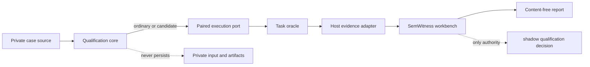

# Qualification Lab

## Product Claim

The Qualification Lab is a provider-neutral host for counterbalanced shadow
experiments. It runs an ordinary arm and a candidate arm against the same
private case, asks a declared task oracle to compare their outcomes, and passes
the complete observation to an evidence adapter. The core never interprets an
intent, decides semantic equivalence, stores a reusable value, or activates a
cache.

SemWitness remains the only component that can assemble and evaluate an intent
cache promotion artifact. A green Lab run means only that the experiment was
complete, bounded, reproducible, and safe to submit to that authority. It does
not mean that the candidate is qualified.

## Boundary

The core owns orchestration and bounded lifecycle only. Deployments provide
replaceable ports for:

- `QualificationCaseSource`: yields private cases in a predeclared order;
- `PairedExecutionPort`: executes exactly one isolated ordinary or candidate
  arm and returns an opaque artifact plus provider accounting;
- `TaskOracle`: compares two opaque artifacts under a versioned task contract;
- `QualificationEvidenceAdapter`: seals one complete or failed observation and
  finalizes the run through an external authority;
- `QualificationArtifactSink`: publishes the content-free artifact atomically.

No core type contains a provider SDK, SemWitness type, Agentic SDLC schema,
prompt, response, intent IR, tenant label, filesystem path, or cache value.

## Experiment Contract

Every case declares a bounded ordinal, cohort, difficulty, cache regime, and
pair order. Population cases use one independence-cluster reference. Adversarial
cases use a predeclared scenario and phenomena vocabulary. References are
opaque keyed bindings supplied by the trusted host, never raw business labels.

The runner enforces these invariants:

1. ordinals are contiguous and unique;
2. case, call, byte, token, and wall-clock budgets are fixed before execution;
3. ordinary/candidate order is balanced inside each declared stratum;
4. each primary-order arm is invoked at most once with a fresh execution scope;
   an optional mirrored reverse order is a repeatability control and never a
   second statistical opportunity;
5. the oracle runs only after both arms return complete observations;
6. timeout, cancellation, malformed output, incomplete accounting, or oracle
   failure becomes a failed evidence record, never a positive result;
7. every attempted case is accounted for; cases are not silently dropped;
8. raw inputs and artifacts are released after sealing and never enter the
   returned report, logs, errors, or artifact path;
9. the external workbench result is forwarded without repair or reinterpretation;
10. no code path can submit candidate content to a production request or read a
    cached response.

## Evidence Levels

### Level 0: conformance

A deterministic fixture proves ordering, isolation, failure accounting,
privacy, exact replay, and adapter boundaries. Its result is always diagnostic
and cannot satisfy a held-out or production claim.

### Level 1: external qualification evidence

A host-owned run additionally binds an immutable dataset/source revision,
family-safe split, inclusion policy, sampling window, provider/runtime/model,
prompt and tool contract, tokenizer, cost model, oracle, evaluator, and every
dependency that can change an answer.

SemWitness decides whether that evidence passes. IntentABI must not duplicate
its counters, confidence bounds, or gate reasons. In particular, a small curated
fixture cannot claim statistical readiness. With zero observed failures, a
one-sided 95% upper bound of `0.001` requires approximately 2,995 independent
trials; stricter response-cache claims require more.

### Level 2: active reuse

Out of scope. It still requires an authenticated, scope-bound store; complete
freshness, authorization, dependency, invalidation, and revocation checks; a
post-read SemWitness admission decision; an authenticated activation artifact;
and a separately versioned active-mode contract.

## First Delivery Slice

The first slice ships the provider-neutral runner, strict schemas, a separate
`intentabi-qualify` application, deterministic fixture ports, a SemWitness
handoff adapter, content-free receipts, and cross-platform tests. It proves the
Level 0 contract and makes Level 1 evidence pluggable without weakening the
authority boundary.

It deliberately does not ship embeddings, a vector database, a semantic-cache
engine, a general natural-language compiler, a response cache, or automatic
activation. RedisVL, GPTCache, vCache, Semantic Router, and provider prefix/KV
caches are future replaceable candidates or baselines, not code to reimplement.

## Acceptance Criteria

### Must for this slice

- the package core has no provider, SemWitness, Codex, or Agentic SDLC import;
- a deterministic run counterbalances AB/BA per stratum and accounts for every
  attempted case;
- malformed ports, incomplete usage, timeout, cancellation, and oracle failure
  produce sealed failures and never a positive classification;
- a repeated run with the same protocol and deterministic ports produces the
  same content-free result digest;
- result artifacts contain no case payload, artifact, prompt, response, raw
  label, tenant, path, provider error, or environment value;
- output uses bounded reads, an owner-only temporary sibling, flush/fsync,
  atomic no-clobber publication, and cleanup on failure;
- the SemWitness adapter forwards already sealed records to the existing
  assembler/evaluator and returns its authoritative result unchanged;
- tests cover success, regression, arm failure, accounting failure, oracle
  failure, timeout, abort, duplicate/gapped ordinals, imbalance, oversize input,
  symlink/no-clobber output, privacy canaries, and deterministic replay;
- `pnpm check`, dependency audit, and CI pass on Linux, macOS, and Windows.

### Must before a qualification claim

- an external held-out source and sampling protocol are immutable and auditable;
- all SemWitness minimum population, critical-cell, adversarial-cell,
  independence, coverage, false-hit, task-quality, and net-value gates pass;
- provider-reported usage and an exact tokenizer/cost model replace heuristic
  accounting;
- no task regression or unsafe admission is observed;
- the same evidence JSONL deterministically yields the same SemWitness report
  and qualification digest;
- a real provider run remains a separate, opt-in, billable workflow.

## Metrics

Reports keep dimensions separate rather than hiding them in one score:

- completeness: attempted, sealed-complete, sealed-failed, dropped;
- safety: task regressions, unsafe admissions, bypasses, oracle failures;
- semantic utility: equivalent opportunities, safe would-hits, coverage;
- value: physical input/output/reasoning tokens, cache reads/writes, retries,
  recovery, normalized cost, and end-to-end latency;
- repeatability: binding, protocol, corpus, report, and qualification digests;
- strata: cohort, difficulty, cache regime, scenario, and phenomenon.

Only the external authority may calculate or label promotion gates from those
observations.

## Threat Model Delta

| Threat                         | Control                                                                              | Residual risk                                                    |
| ------------------------------ | ------------------------------------------------------------------------------------ | ---------------------------------------------------------------- |
| benchmark leakage              | family-safe external split and immutable source/protocol digests                     | public datasets may already be present in model training         |
| order or cache-state bias      | AB/BA balance per stratum and fresh arm scope                                        | provider-side state outside the host may remain shared           |
| oracle laundering              | versioned deterministic oracle, raw outcome unavailable to core, failure is negative | a wrong trusted oracle can still certify the wrong task property |
| selective dropping             | contiguous ordinals and one sealed record per attempted case                         | a malicious source can bias the population before admission      |
| accounting fabrication         | provider observation port, completeness bit, exact contract digest                   | a compromised provider adapter can lie                           |
| payload leakage                | opaque core values, content-free schemas, privacy canaries, bounded constant errors  | trusted adapters necessarily see private cases and outcomes      |
| artifact replacement           | digest-bound protocol and atomic no-clobber owner-only publication                   | unsigned evidence still lacks producer authentication            |
| benchmark-to-serving confusion | diagnostic classification and no candidate-content API                               | an external consumer can ignore the stated activation ceiling    |
